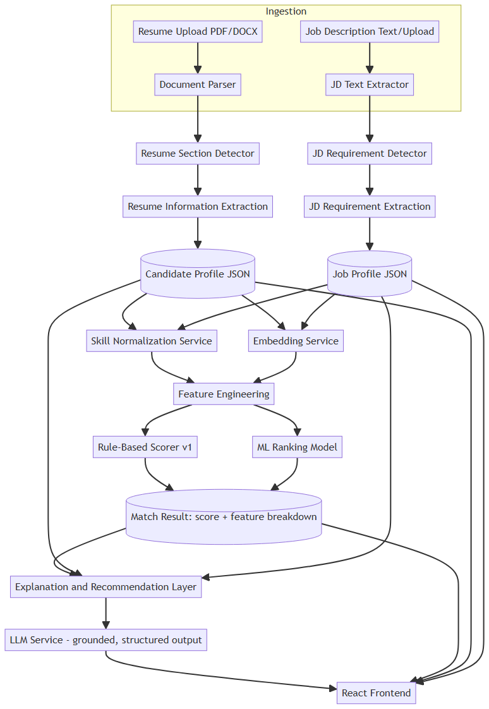

# AI Resume–Job Matching & Optimization System

[](https://github.com/price-2006/proj_big_leagues/actions/workflows/ci.yml)

An end-to-end system that parses resumes and job descriptions, extracts structured candidate/job profiles, uses transformer-based embeddings for semantic matching, combines those signals with engineered features into a transparent match score, and trains a ranking model to compare it against. An evidence-constrained LLM layer explains results and suggests resume improvements — it never invents a score, a skill, or an achievement.



## Why this exists

This is explicitly *not* `resume → LLM → "your score is 82%"`. The match score is produced by a hybrid pipeline — NLP extraction, skill taxonomy normalization, embedding-based semantic similarity, engineered features, and a rule-based baseline compared against a trained ML ranking model. The LLM is confined to the explanation/recommendation layer, reading only what the deterministic pipeline already computed, with every claim it makes validated against actual extracted evidence before being shown to a user. Full rationale in [`docs/ARCHITECTURE.md`](docs/ARCHITECTURE.md) §1.

## What's actually built

Every stage in the diagram above is real, working code, not a design sketch:

- **Document parsing** (PDF via PyMuPDF, DOCX via python-docx) with layout-aware section detection for both resumes and job descriptions.
- **Information extraction** — spaCy NER + a skills gazetteer turns raw text into structured `CandidateProfile`/`JobProfile` JSON.
- **Skill taxonomy normalization** — a 3-stage pipeline (exact/alias → fuzzy → embedding-suggested) with a disambiguation blocklist so "React" never silently matches "React Native".
- **Feature engineering** — a 10-feature vector per (resume, job) pair, computed from the structured profiles plus Sentence-Transformer embeddings.
- **Rule-based scorer** — a transparent, always-on weighted formula; the score you see is human-auditable, not a black box.
- **ML ranking models** — Logistic Regression, Random Forest, XGBoost, LightGBM, and a LightGBM LTR ranker, trained on a real (weakly-supervised) dataset and evaluated with real, honestly-reported numbers — see [Evaluation](#evaluation-real-numbers-not-placeholders) below.
- **LLM explanation layer** — Anthropic, OpenAI, or a local Ollama model generate the narrative/strengths/weaknesses/recommendations; every claim is checked against the actual extracted evidence afterward and silently stripped if it doesn't trace to something real. The match score is computed and stored *before* the LLM is ever called, so nothing it generates — including a prompt-injection attempt embedded in a resume — can touch it.
- **React frontend** — upload a resume, analyze job descriptions, see the score breakdown, compare multiple jobs side by side, and get AI recommendations with click-to-reveal evidence.
- **Security hardening** — upload size/magic-byte/XXE validation, a parse timeout guard, Redis-backed rate limiting, a resume delete endpoint that actually cleans up after itself, and a documented security audit ([`docs/SECURITY.md`](docs/SECURITY.md)).

The one thing intentionally **not** wired up: the trained ML models aren't yet used for live scoring (`matches.ml_score` is still `null` in the running app) — `evaluate.py` trains and evaluates them for real, but promoting one to production scoring is future work, not something asserted here as done.

## Documentation

- [`docs/ARCHITECTURE.md`](docs/ARCHITECTURE.md) — component diagram, technology choices and why, database schema, NLP pipeline, feature engineering and scoring design, LLM integration and hallucination control, API design, frontend architecture, security architecture, evaluation design.
- [`docs/DATASET_STRATEGY.md`](docs/DATASET_STRATEGY.md) — which real datasets were used, their actual limitations and licensing, and the weak-supervision strategy for where real relevance labels don't exist.
- [`docs/ROADMAP.md`](docs/ROADMAP.md) — the phased build plan this project was built against; every phase was independently tested before the next began.
- [`docs/SECURITY.md`](docs/SECURITY.md) — the security hardening audit: what was found, what changed, how each item is verified.
- [`data/README.md`](data/README.md) — real dataset sources, real bugs found while building the training pipeline (and how they were fixed and reverified), and the real evaluation numbers behind the table below.

## Getting started

```bash
git clone https://github.com/price-2006/proj_big_leagues.git
cd proj_big_leagues
cp .env.example .env

docker compose up
```

That's it — no other manual steps. On first run, the backend automatically applies database migrations and seeds the skill taxonomy before it starts serving (`docker/backend-entrypoint.sh`); nothing needs to be run by hand.

- Frontend: **http://localhost:3000**
- Backend API: **http://localhost:8000** (docs at `/docs`, health check at `/health`)

Everything works out of the box **except** the AI recommendations feature, which needs an LLM configured:

- **No key, no setup**: set `LLM_PROVIDER=local` in `.env` and point `OLLAMA_BASE_URL` at a running [Ollama](https://ollama.com) instance (`http://host.docker.internal:11434` if Ollama runs on your host machine, outside Docker).
- **Hosted**: set `LLM_PROVIDER=anthropic` or `openai` and `LLM_API_KEY` to a real key.

Resume upload, job analysis, matching, scoring, and job comparison all work fully without any LLM configured — only the "Get AI recommendations" button needs one.

### Local development loop

Docker Compose is the fastest path to a fully working system, but iterating on one service at a time is faster locally:

```bash
# Backend
docker compose up -d postgres redis
cd backend
python3 -m venv .venv && source .venv/bin/activate   # Windows: .venv\Scripts\activate
pip install -r requirements-dev.txt
python -m spacy download en_core_web_sm
alembic upgrade head
python -m scripts.seed_skills
python -m scripts.embed_skills
uvicorn app.main:app --reload
pytest

# Frontend (in another terminal)
cd frontend
npm install
npm run dev      # proxies /api to localhost:8000, see vite.config.ts
npm test
```

## Evaluation — real numbers, not placeholders

Trained on a real (weakly-supervised) dataset, evaluated on a genuinely held-out test split, broken out per label source — never blended into one number, since no source here is trusted as ground truth yet (see [`docs/DATASET_STRATEGY.md`](docs/DATASET_STRATEGY.md) §3). Full methodology, the real bugs found while building this, and the honest reading of what these numbers mean are in [`data/README.md`](data/README.md).

**`dataset:cnamuangtoun` test split (n=1,133):**

| approach | precision | recall | f1 | roc_auc | ndcg@5 | mrr |
|---|---|---|---|---|---|---|
| rule_based | 0.000 | 0.000 | 0.000 | 0.491 | 0.447 | 0.261 |
| embedding_cosine | 0.705 | 0.161 | 0.263 | 0.618 | 0.491 | 0.583 |
| logistic_regression | 0.484 | 0.102 | 0.169 | 0.488 | 0.446 | 0.465 |
| random_forest | 0.615 | 0.014 | 0.027 | 0.511 | 0.479 | 0.451 |
| xgboost | 0.767 | 0.040 | 0.076 | 0.508 | 0.471 | 0.450 |
| lightgbm | 0.722 | 0.023 | 0.044 | 0.511 | 0.479 | 0.455 |
| lightgbm_ranker | 0.571 | 0.069 | 0.124 | 0.511 | 0.474 | 0.422 |

The plain embedding-cosine baseline is competitive with, or ahead of, every trained model here — reported plainly, not reframed. At this data scale (~7k training rows, no hyperparameter search beyond fixed configs), the trained models haven't yet clearly beaten the simplest possible similarity score. `data/README.md` has the full breakdown (a second label source, the small-sample caveats on a third, and why).

Reproduce it yourself: `docker exec resume_matcher_backend python -m scripts.build_dataset && python -m scripts.train_model && python -m evaluation.evaluate`.

## Tech stack (see [`docs/ARCHITECTURE.md`](docs/ARCHITECTURE.md) §4 for full justification)

Backend: Python, FastAPI, Pydantic, SQLAlchemy (async) + Alembic. ML/NLP: PyTorch, Sentence-Transformers, spaCy, scikit-learn, XGBoost, LightGBM, MLflow. Documents: PyMuPDF, python-docx, defusedxml. Database: PostgreSQL + pgvector. Cache/rate-limiting: Redis, slowapi. LLM: Anthropic, OpenAI, or local Ollama behind a swappable interface. Frontend: React + TypeScript, Tailwind, React Query, openapi-typescript. Deployment: Docker Compose (postgres, redis, backend, frontend); CI on every push via GitHub Actions.

## Repository structure

```
proj_big_leagues/
├── backend/
│   ├── app/
│   │   ├── api/          # FastAPI routers
│   │   ├── models/       # SQLAlchemy models
│   │   ├── schemas/      # Pydantic request/response + domain schemas
│   │   ├── services/     # EmbeddingService, LLMService, scoring orchestration
│   │   ├── ml/           # feature engineering, rule-based scorer, evidence validation
│   │   ├── nlp/           # section detection, information extraction, skill normalization
│   │   ├── parsers/       # PDF/DOCX text + layout extraction
│   │   └── main.py
│   ├── scripts/            # dataset build, skill seeding, model training
│   ├── evaluation/          # evaluate.py
│   ├── tests/
│   └── requirements.txt
├── frontend/
│   ├── src/
│   └── package.json
├── data/                     # data/README.md documents sources/licenses; no raw data committed
├── docker/
├── docs/                       # ARCHITECTURE.md, DATASET_STRATEGY.md, ROADMAP.md, SECURITY.md
├── .env.example
├── docker-compose.yml
└── README.md
```

## Testing

223+ backend tests (pytest) and a frontend suite (vitest) cover the pipeline end to end — real spaCy/embedding-model runs where it matters, not everything mocked. Adversarial cases are tested directly: prompt injection embedded in a resume, thin-evidence hallucination, oversized/wrong-magic-byte/XXE-payload uploads, and SQL-injection payloads through every text input.

```bash
docker exec resume_matcher_backend pytest -q
cd frontend && npm test
```
